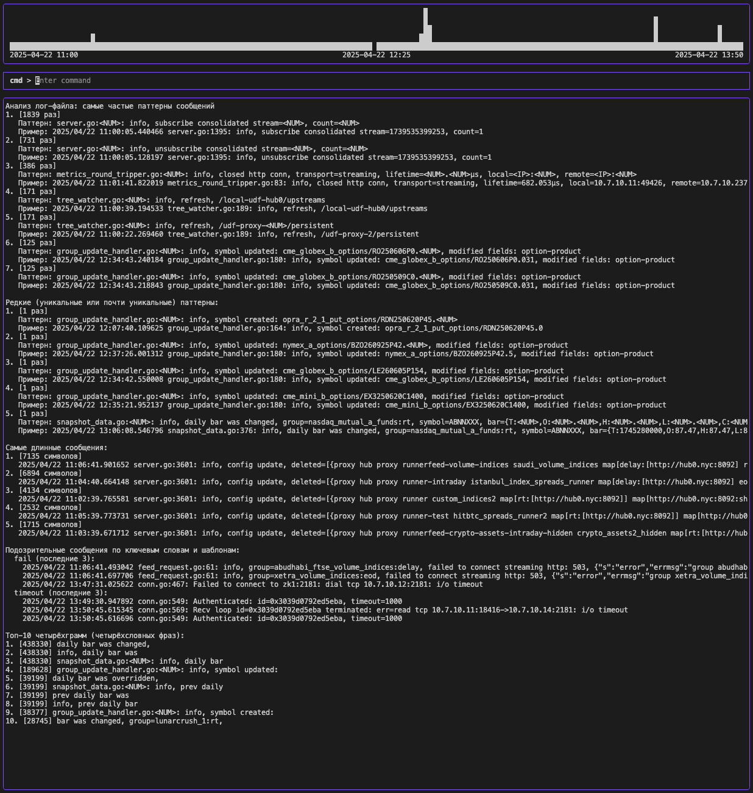
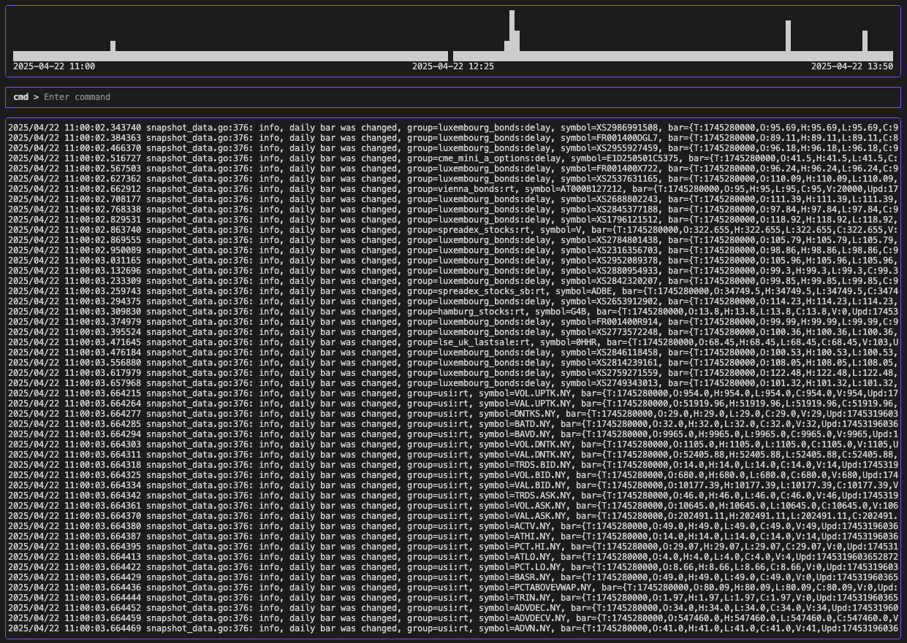

# log-tools

[](https://github.com/DmitriyPanteleev/log-tools/releases)
[](https://goreportcard.com/report/github.com/DmitriyPanteleev/log-tools)
[](LICENSE)

**log-tools** — интерактивная консольная утилита для анализа и визуализации лог-файлов с поддержкой различных форматов таймштампов. Позволяет быстро просматривать, фильтровать, анализировать и находить аномалии в логах.

---

## 🚀 Возможности

- Поддержка десятков форматов таймштампов (автоматическое определение)
- Визуализация активности логов в виде гистограммы
- Быстрый переход к нужному времени (`goto`)
- Фильтрация по регулярным выражениям (`filter`)
- Статистика по лог-файлу (`stat`)
- Анализ частых и редких паттернов сообщений (`analyse`)
- Поиск подозрительных сообщений (ошибки, исключения и др.)
- Удобный TUI-интерфейс на базе [Bubble Tea](https://github.com/charmbracelet/bubbletea)

---

## 📸 Скриншоты

| Гистограмма и анализ логов | Фильтрация по регулярному выражению |
|-----------------------------|-------------------------------------|
|  |  |

---

## 🛠️ Сборка и запуск

### Сборка из исходников

```sh
git clone https://github.com/DmitriyPanteleev/log-tools.git
cd log-tools
go build -o log-tools main.go formats.go
```

### Скачать готовый бинарник

Перейдите в раздел [Releases](https://github.com/DmitriyPanteleev/log-tools/releases) и скачайте подходящую версию для вашей платформы (Linux или macOS).

---

## ⚡ Быстрый старт

```sh
./log-tools <имя_лог_файла>
```

После запуска вы увидите TUI-интерфейс с гистограммой активности логов и командной строкой.

### Доступные команды:

- `list` — Показать все записи логов
- `goto` — Перейти к указанному таймштампу
- `filter` — Отобразить строки, соответствующие регулярному выражению
- `stat` — Сформировать статистику по лог-файлу
- `analyse` — Расширенный анализ лог-файла
- `quit` — Выйти из приложения
- `help` — Показать справку

#### Примеры:

- Перейти к определённому времени:
  ```
  goto
  > 2024-06-01 12:34
  ```
- Фильтровать по ошибкам:
  ```
  filter
  > error|fail|exception
  ```

---

## 🗺️ Roadmap

- [ ] Провести рефакторинг проекта разбив на логические части (выделить интерфейс и комманды в отдельные файлы)
- [ ] Цветовая раскаска выводимого фрагмента лог-файла
- [ ] Цветовая подсветка паттернов и ошибок
+ [ ] Сделать поэтапный вывод информации пользователю при долгих операциях
+ [ ] Перевести ресурсоемкие операции на горутины (параллельную обработку)
- [ ] В комманды analyse и stat добавить дополнительные ключи, позволяющие запускать только отдельные шаги анализа или сбора статистики
- [ ] В функции анализа реализовать доменную саммаризацию (с растоянием по Левенштейну)
- [ ] Экспорт статистики и анализа в файл (CSV/Markdown)
- [ ] Поддержка бинарных форматов логов (journald)

---

## 👥 Авторы и контрибьюторы

- **Дмитрий Пантелеев** — [github.com/DmitriyPanteleev](https://github.com/DmitriyPanteleev) — автор и основной разработчик

Будем рады любым [pull requests](https://github.com/DmitriyPanteleev/log-tools/pulls) и предложениям по улучшению!

Становись соавтором!!!

---

## 📬 Обратная связь и вопросы

Если у вас есть вопросы, предложения или вы нашли баг — создайте [issue](https://github.com/DmitriyPanteleev/log-tools/issues) или напишите автору напрямую через GitHub.

---

## 📄 Лицензия

Проект распространяется под лицензией [GNU GPL v3](LICENSE).

---
